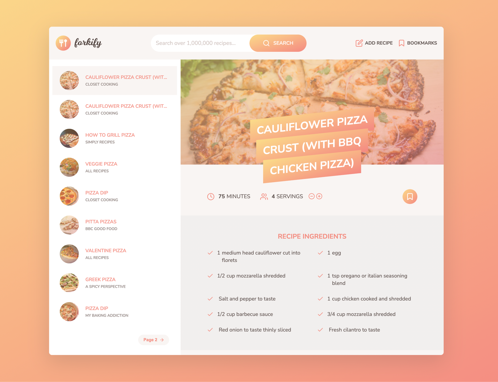

# WELCOME TO THE "forkify" PROJECT README

 

"forkify" is a recipe application with custom recipe uploads.

The test website url: https://vitalii-plechak-forkify.netlify.app/

### Setup local env:
* Run `npm install`
* To start env in development mode run `npm start`
* To build application run `npm run build`

### Project features
* The forkify application is fully accessible with a keyboard, so, just try it.
* To use the "Add recipe" feature, install the project, configure API_KEY on https://forkify-api.herokuapp.com/v2 and update the config file with your API key.